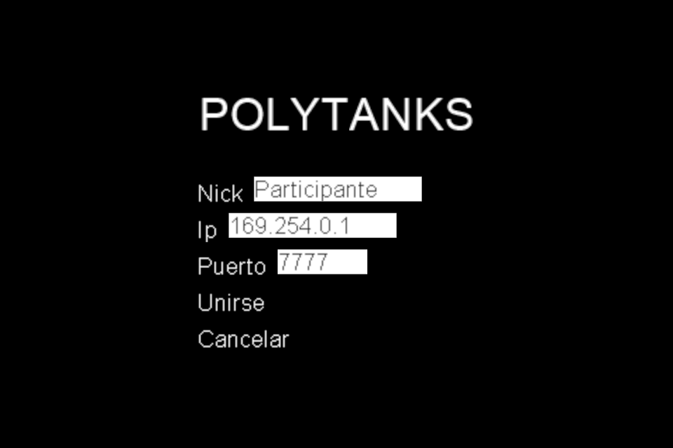
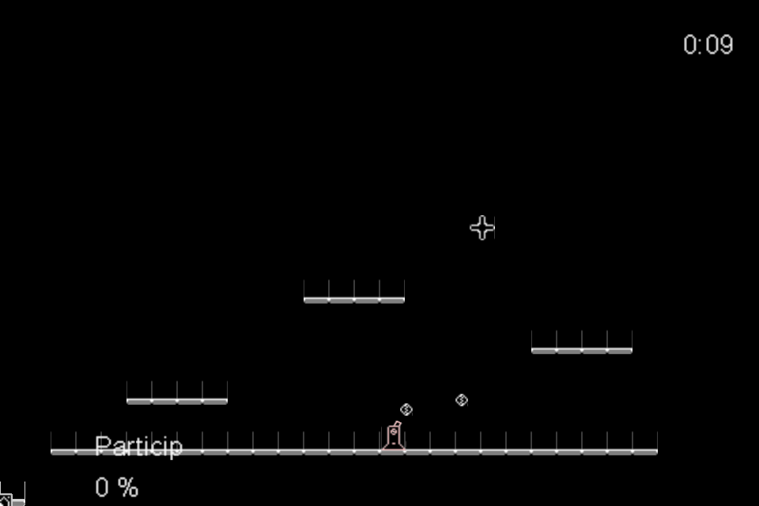

Cliente
=======

El cliente usa :obj:`pyglet` para procesar entradas y procesar los gráficos. Pyglet
tiene un sistemas de eventos propio como :obj:`asyncio`. Usar asyncio con pyglet
hace bastante complicado su uso. Así que para poder usar la conexión asíncrona
cómodamente se usa el módulo :obj:`selectors`. :obj:`selector` es mas bajo nivel
que :obj:`asyncio` pero se integra muy bien con el sistema de evento de :obj:`pyglet`
ya que no tiene control del flujo o del tiempo.

El cliente debe correr a la misma velocidad que el servidor a :obj:`TICKRATE`, que
por lo general es de 60 marcos por segundo.

Interfaces
----------

Interfaz de usuario
+++++++++++++++++++

Permite al usuario conectarse cómodamente a un servidor y notificar si ha habido
fallos de conexión con el servidor.

Pantalla de juego
+++++++++++++++++

En la pantalla de juego muestra dónde transcurre el juego, el estado actual
del servidor. Tiene contadores de daños de cada uno de los tanques que se
actualizarán si reciben daño los tanques correspondientes, el nick se asocia
al contador. También se muestra el estado del modo de juego del servidor, como el tiempo
restante.

Recibir mensajes del servidor
-----------------------------

Los únicos mensajes que reciben el cliente del servidor son los SNAPSHOT periódicamente
una vez conectado con JOIN. También si el snapshot es pedido explícitamente
con REQUEST_SNAPSHOT después de haber rebido JOINED del servidor.

